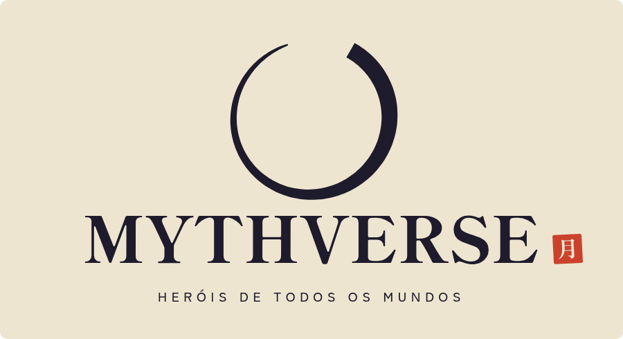

# MYTHVERSE — Heróis de todos os mundos

<p align="center"></p>

RPG de equipe com combate automático e decisões estratégicas. Sessenta heróis de animes e jogos atravessam a **Fenda** para salvar Tsukimori do eclipse. Convoque, forme laços, monte builds e derrube chefes que exigem preparo de verdade.

## 🆓 Testar online de graça (Neon + Render)

O jogo roda no plano **Free** do [Render](https://render.com), e as contas e os saves ficam num banco PostgreSQL grátis no [Neon](https://neon.com). O Neon não pede cartão. O Render às vezes pede um para verificar a conta, mas não cobra nada no plano Free. Leva uns 10 minutos.

1. **Banco (Neon):** crie a conta, clique em **Create project** e escolha a região **AWS US East 1 (N. Virginia)**. No projeto, clique em **Connect** e copie a *connection string* (começa com `postgresql://` e termina com `sslmode=require…`).
2. **Servidor (Render):** entre com o GitHub e clique em **New +** → **Blueprint**. Escolha o repositório **mythverse** e a branch que tem este arquivo (`claude/charming-goldberg-975nzq`). O `render.yaml` já vem configurado para o plano Free.
3. Quando o Render pedir **`DATABASE_URL`**, cole a connection string do Neon e clique em **Apply**.
4. Espere aparecer **Live** (3 a 5 minutos) e abra o link `https://mythverse-xxxx.onrender.com`. As tabelas são criadas sozinhas no primeiro início.
5. Para conferir, abra `https://mythverse-xxxx.onrender.com/api/health`. Tem que aparecer `"db":"postgres"`.

> ⏳ **Limites do grátis:** o Render desliga o servidor depois de 15 minutos sem acessos, e o próximo acesso demora cerca de 1 minuto para acordar. O Neon também dorme quando ninguém joga e acorda sozinho. Serve para testar, não para lançar: o Neon grátis guarda 0,5 GB e só permite restaurar as últimas 6 horas. Confira os limites atuais em [render.com/pricing](https://render.com/pricing) e [neon.com/pricing](https://neon.com/pricing).

📘 **Passo a passo detalhado**, com o que aparece em cada tela, backups e solução de problemas: [DEPLOY.md](DEPLOY.md).

Para rodar com Neon no próprio computador, crie um arquivo `.env` com `DATABASE_URL=...` e rode `npm install` e `npm start`. Sem `DATABASE_URL`, o servidor usa o SQLite local de sempre.

---

## 🌐 Como colocar o jogo online de vez (Render pago, com disco)

Siga na ordem. Não precisa saber programar. Leva uns **20 minutos** na primeira vez.

### Antes de começar: o que você vai usar

| Serviço | Para quê | Custo |
|---|---|---|
| **GitHub** | Guardar os arquivos do jogo na internet | Grátis |
| **GitHub Desktop** | Programa que envia os arquivos para o GitHub | Grátis |
| **Render** | O servidor onde o jogo fica ligado 24h | Plano **Starter** (cerca de US$ 7/mês) + disco (cerca de US$ 0,25 por GB/mês) |

> ⚠️ **Por que pagar?** O plano grátis do Render **não tem disco permanente** e dorme sem acessos. Para testar, use o modo grátis com Neon descrito acima. Para um jogo com contas de verdade, use o plano Starter com disco. Os preços podem mudar; confira em [render.com/pricing](https://render.com/pricing).

### Passo 1 — Criar a conta no GitHub

1. Acesse [github.com](https://github.com) e clique em **Sign up**.
2. Crie a conta com seu e-mail e confirme o código que chegar.

### Passo 2 — Enviar o jogo para o GitHub

1. Baixe e instale o **GitHub Desktop**: [desktop.github.com](https://desktop.github.com).
2. Abra o programa e entre com a conta do GitHub (**Sign in to GitHub.com**).
3. Clique em **File → Add local repository…** e escolha **esta pasta** (a que tem este arquivo `README.md`).
4. O programa vai dizer que a pasta ainda não é um repositório. Clique em **create a repository**.
   - **Name:** `mythverse`
   - Clique em **Create repository**.
5. Clique em **Publish repository** (botão azul no topo).
   - Deixe marcado **Keep this code private** se não quiser que outras pessoas vejam o código.
   - Clique em **Publish repository**.

✅ Pronto: o jogo está no seu GitHub.

### Passo 3 — Criar a conta no Render

1. Acesse [render.com](https://render.com) e clique em **Get Started**.
2. Escolha **Sign in with GitHub**. Assim o Render já enxerga seus repositórios.
3. Cadastre um cartão de crédito em **Billing**, porque o plano Starter é pago.

### Passo 4 — Ligar o servidor

1. No painel do Render, clique em **New +** → **Blueprint**.
2. Escolha o repositório **mythverse** (se ele não aparecer, clique em **Configure account** e libere o acesso a ele).
3. No campo do caminho do Blueprint, troque `render.yaml` (a versão grátis) por **`render.starter.yaml`**. O Render lê esse arquivo e mostra:
   - um **Web Service** chamado `mythverse`;
   - um **Disk** chamado `mythverse-data` (é onde ficam as contas e os saves).
4. Clique em **Apply** (ou **Deploy Blueprint**).
5. Aguarde de **3 a 5 minutos**. Acompanhe em **Events/Logs**. Quando aparecer **Live** em verde, está no ar.

### Passo 5 — Jogar

1. No topo da página do serviço há um link parecido com **`https://mythverse-xxxx.onrender.com`**.
2. Abra, clique em **Criar conta** e jogue. Mande o link para seus amigos!

### Passo 6 (opcional) — Usar um domínio próprio (ex.: `mythverse.com.br`)

1. Compre o domínio (no [registro.br](https://registro.br) para `.com.br`).
2. No Render: serviço **mythverse** → **Settings** → **Custom Domains** → **Add Custom Domain** e digite o domínio.
3. O Render mostra um registro **CNAME** (ou A). Copie-o para a área de **DNS** do registro.br.
4. Em até algumas horas o domínio passa a funcionar, com **HTTPS (cadeado) automático**.

### Como atualizar o jogo depois

1. Altere os arquivos na pasta.
2. No GitHub Desktop, escreva um resumo em **Summary** (ex.: "novos heróis"), clique em **Commit to main** e depois em **Push origin**.
3. O Render detecta a mudança e publica sozinho em poucos minutos. **As contas e os saves continuam salvos** (ficam no disco).

### Backups

- O servidor faz um **backup automático do banco a cada 6 horas** e guarda os 14 mais recentes no disco.
- Cada jogador também tem **20 cópias do próprio save**, que ele mesmo pode restaurar em **Perfil → Conta**.
- O Render também oferece **snapshots do disco** (menu **Disks** do serviço).

### Deu problema?

| O que aconteceu | O que fazer |
|---|---|
| O deploy falhou (vermelho) | Abra **Logs** e procure a primeira linha com "Error". Confira se todos os arquivos foram enviados no Passo 2. |
| "Disk requires a paid plan" | Mude o serviço para o plano **Starter** em **Settings → Instance Type**. |
| O site abre, mas não consigo entrar | Use o endereço **https://** (com cadeado). O login só funciona em HTTPS no servidor. |
| As contas sumiram depois de atualizar | O disco não foi criado. Confira em **Disks** se o `mythverse-data` existe e está montado em `/data`. |

Guia técnico completo (Docker, VPS, Fly.io, variáveis e segurança): [DEPLOY.md](DEPLOY.md).

---

## 💻 Jogar no próprio computador

- **Com contas e save na nuvem:** instale o [Node.js 24](https://nodejs.org), dê duplo clique em `START_GAME.bat` (Windows) ou rode `npm start`, e abra http://localhost:8080.
- **Modo offline:** abrir `index.html` direto no navegador também funciona, mas o progresso fica só nesse navegador, sem conta e sem ranking.

Saves da versão antiga (Hoshikage) não são compatíveis: a nova jornada começa do zero.

## Online

- **Tela de entrada** com login, criação de conta (com aceite dos Termos e da Política de Privacidade) e recuperação de acesso por **código de recuperação**.
- **Save na nuvem** automático a cada 30s e ao fechar a aba. Cada save tem revisão, com resolução de conflito entre dispositivos e **20 cópias de segurança** restauráveis.
- **Ranking** por poder, chefes derrotados e progresso. O poder é recalculado pelo servidor.
- **Conta**: trocar senha, gerar novo código de recuperação, encerrar outras sessões, exportar dados e excluir a conta (LGPD).
- **Servidor** em Node puro com SQLite embutido (WAL, verificação de integridade, backups automáticos) ou PostgreSQL/Neon via `DATABASE_URL`, além de migrações, scrypt, sessões HttpOnly, CSRF, limites de tentativa e CSP.

## O que existe no jogo

### Equipe e heróis
- **60 heróis**, cada um com kit próprio: **passiva**, **habilidade automática** e **ultimate** (100 de energia; Q/W/E/R ou AUTO). As descrições são geradas a partir dos efeitos reais.
- **5 classes**: Vanguarda, Executor, Arcanista, Atirador e Suporte. Cada uma tem traço próprio, sinergia de equipe e posição ideal.
- **Formação**: as vagas 1–2 são a linha de frente, e os inimigos atacam a frente 3× mais que a retaguarda.
- **9 elementos**, com vantagens de +30% e desvantagens de −20%, e **sinergia de elemento** (2, 3 ou 4 heróis iguais).
- **30 laços** entre personagens com história juntos (ex.: Goku + Vegeta, Levi + Mikasa + Eren, Cloud + Tifa + Sephiroth).
- **Atributos clássicos** por herói: FOR, AGI, VIT, INT, DES e SOR, com 3 pontos por nível.
- **Árvore de talentos própria de cada herói**, baseada na classe: 3 círculos, nós com ícones e ranks, Notáveis, Pedras-chave e nós exclusivos que fortalecem a habilidade e a ultimate daquele herói. Rende 1 ponto por nível.
- **Mudança de Classe** no nível 30, como os jobs do Ragnarok: Paladino, Mestre das Lâminas, Sábio Arcano, Franco-Atirador e Sumo Sacerdote (+10% nos atributos, +5 pontos e acesso ao Círculo III).
- **Raridade, estrelas e Despertar**: heróis repetidos viram fragmentos, e cada ★ dá +12% nos atributos e +8 níveis máximos.

### Progressão da conta
- **Treino da equipe** no Dojo: ATK, HP, DEF e Crítico para todos os heróis.
- **Construções**: Forja, Dojo, Santuário, Oficina, Guilda e Mercado. O nível máximo acompanha o nível da conta.

### Itens e builds
- **4 espaços** de equipamento: Arma, Foco, Selo e Omamori.
- **35 bases** de item por nível, **19 afixos** aleatórios e raridades Comum, Raro, Épico, Lendário, Mítico e Conjunto.
- **7 conjuntos** com bônus de 2 e 4 peças, cada um vindo de uma fonte específica.
- **16 itens míticos únicos** com efeitos especiais (renascer, ataques em área, reflexo, reinício de recarga…).
- **Cartas** no estilo Ragnarok: cada um dos 30 monstros tem a sua, e os chefes deixam **cartas MVP** raríssimas. Elas encaixam nos **slots** dos equipamentos (0 a 2, conforme a raridade).
- **Forja**: aprimoramento de +1 a +15, que pode falhar acima de +5 sem perder o item, e desmontagem em Tamahagane e Éter.
- **Oficina**: encantamentos que re-sorteiam afixos e receitas de poções.
- Bolsa com filtros, comparação e trava de itens, mais desmontagem manual e automática.

### Mundo
- **Capítulo I**: Bosque das Lanternas (12 estágios) → Templo do Véu (3 andares) → **Shirogane** (chefe da região).
- **Capítulo II**: Costa das Marés → Arquivo Submerso → **Mizuchi**. O capítulo II só abre depois de derrotar Shirogane.
- **Evento**: Kitsune das Lanternas, disponível durante o Festival.
- **Monstros exclusivos** por região (27 criaturas), cada um com habilidade própria. Guardiões aparecem a cada estágio, e há chefes de andar com ataques telegrafados.
- **Chefes** com 3 fases, ataques preparados (⚠ e zona de perigo), invocações, cura e **Fúria** por tempo. Dificuldades Normal, Pesadelo e Inferno.
- **Eventos mundiais** a cada 2 horas: Maré Dourada, Lua de Sangue, Festival das Lanternas e Chuva de Estrelas.
- **Encontros aleatórios** nas caçadas: Raposa Dourada, Mercador Errante, Santuário (bênçãos), Emboscada e Baú Misterioso (pode ser um Mímico).
- **História** contada por Sayo, a Guardiã do Véu, com falas dos chefes.

### Ritmo e dificuldade
- Os inimigos ficam **20% mais fortes a cada estágio**, e o poder recomendado de cada região aparece na tela.
- **Derrota não te tira da luta**: na caçada, a equipe recua um estágio e continua treinando. Em dungeons e chefes, a equipe volta a treinar automaticamente.
- Progresso **offline** de até 12 horas (ouro, EXP, itens e materiais).

### Guia, missões e loja
- **Guia do Viajante** com 19 passos e recompensas, sempre visível no painel lateral.
- **Contratos da Guilda** que se renovam e **36 conquistas**.
- **Loja** em ouro (poções, elixires, pergaminhos de EXP, materiais) e em cristais (chaves, expansão da bolsa, incenso de EXP/ouro, redefinição de talentos), além do **Mercado** com ofertas a cada 2 horas.
- **Gemas (dinheiro real)**: os pacotes aparecem, mas a compra está **desativada** até existir um servidor oficial com provedor de pagamento. Nenhum dado de pagamento é pedido ou armazenado.
- **Wiki completa** dentro do jogo, gerada a partir dos dados reais: combate, classes, elementos, laços, os 60 kits, itens, conjuntos, únicos, monstros, chefes, eventos, progressão e economia.

## Controles

| Tecla | Ação |
|---|---|
| Q W E R | Ultimate dos heróis 1–4 |
| 1 / 2 | Poção de Cura / Elixir de Energia |
| A | Liga/desliga ultimates automáticas |
| M · I · T | Mapa · Bolsa · Talentos do herói |
| Clique no inimigo | A equipe foca nesse alvo |
| ESC | Fecha painel ou diálogo |

## Arquitetura

Sem frameworks nem dependências de runtime. Os scripts são clássicos, carregados em ordem:

- `src/data.js`: elementos, classes, sinergias, laços, monstros, regiões, eventos, encontros, história, guia, contratos, conquistas e construções.
- `src/items.js`: bases, afixos, conjuntos, únicos, drops, aprimoramento e desmontagem.
- `src/progression.js`: atributos, árvore de talentos, treino e loja.
- `src/roster.js`: os 60 kits (linguagem de efeitos) e o gerador de descrições.
- `src/engine.js`: estado, cálculo de atributos, combate com efeitos e status, estágios, chefes, talentos, cartas, economia e offline.
- `src/net.js` e `src/auth.js`: cliente da API, sincronização na nuvem e tela de entrada.
- `server/`: servidor HTTP (`index.js`), banco SQLite ou PostgreSQL (`db.js`), segurança (`security.js`) e validação de saves com o mesmo código do jogo (`game.js`).
- `src/renderer.js`: palco em Canvas (câmera, auras em silhueta, VFX, telegraph, cut-ins).
- `src/ui.js` e `src/panels.js`: HUD, diálogos, resultados e todas as telas.
- `src/main.js`: boot, loop, sons sintetizados e save automático.

## Ferramentas

```bash
npm test                    # 538 verificações do jogo + 46 do servidor (contas, CSRF, conflitos, LGPD, backup)
TEST_DATABASE_URL=postgresql://… node tests/server.test.js   # os mesmos testes do servidor no PostgreSQL
node tools/sim.js 6 7       # simula 6h de um jogador automático e mostra os marcos de progressão
python tools/build_sprites.py  # regenera sprites, retratos, ícones e variantes a partir dos atlas
```

O simulador serviu para calibrar o balanceamento. Um jogador otimizado chega ao estágio 12 do Bosque em cerca de 1h e ao Templo III em cerca de 2h, e só derrota Shirogane perto das 5h, depois de várias tentativas. Equipes sem Suporte não vencem o chefe.

## Arte e licenças

Os retratos, monstros, chefes, cenários e ícones vêm dos atlas ilustrados do protótipo, recortados e com contorno pelo script em `tools/`. As variantes de monstros e itens são recolorações dessas artes. Proveniência em `docs/CROSSOVER_ASSETS.md`. Os personagens pertencem às suas franquias; o uso comercial depende das licenças em negociação informadas pelo responsável do projeto.
